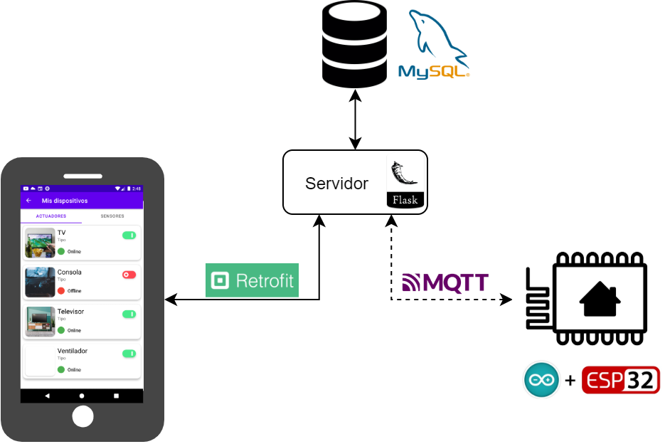
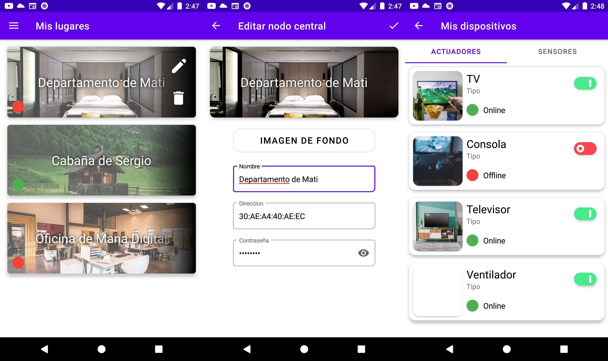
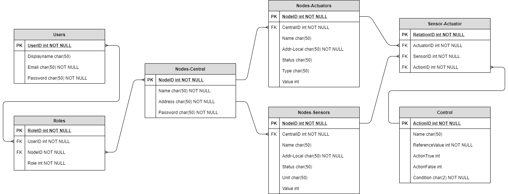

# Automastic Home v2
Bases de Datos x Proyecto Final - Ingeniería Electrónica, UTN FRBA.

## Contenido del repositorio
Este repositorio cuenta con:
- El código fuente de la aplicación Android que controla los nodos.
- El código fuente del servidor que expone la API REST para consultar la BD.
- El código fuente del firmware del nodo central, junto con un script que simula un nodo central.
- El diagrama entidad-relación de la base de datos del proyecto Automastic.
- La secuencia SQL de generación de una BD de prueba.

## Aplicación Android:
Desarrollada en Android Studio, siguiendo el patrón de diseño MVVM y Clean Architecture. 

Cada usuario tiene su lista de nodos centrales asociados, con diferentes roles (administrador, usuario o invitado) y por ende diferente jerarquía de acción sobre el mismo. Al hacer click en un nodo, se mostrará la lista de actuadores y sensores que controla dicho nodo central. Por el momento, los actuadores son solamente ON-OFF, y los sensores muestran su valor como texto.

A continuación se muestran un par de capturas de la aplicación:

## Base de datos SQL:
El diagrama entidad-relación fue pensado teniendo en cuenta los siguientes supuestos:

 1. En cada hogar o espacio habría un nodo central, que se conecta con
    nodos remotos. De ahí se desprenden dos tablas: una de nodos
    centrales, y otra de nodos remotos, con una relación entre sí de
    one-to-many.
 2. Además, como los nodos remotos pueden ser actuadores o sensores, se separaron en dos tablas por funcionalidad. Los actuadores pueden ser tipo ON/OFF o dimmerizables (controlado por los campos Type y Value).
 3. Desde el punto de vista del usuario, la dirección de cada nodo remoto estará conformada por dos direcciones: la del nodo central, y la del nodo remoto local respecto del central. La relación entre las tablas de usuario y de nodos centrales es many-to-many (un usuario puede visualizar varios nodos centrales, habitaciones, y un nodo central puede ser visualizado por varios usuarios).
 4. Sin embargo, entre el usuario y el nodo central existe una tabla intermedia que define el rol del usuario sobre ese nodo central (Admin, Share o Invited).
 5. Se dispone de una tabla adicional que define acciones automáticas sobre actuadores a partir de la medición de algún sensor, definibles los parámetros por los usuarios administradores.

## Servidor:
Está programado en Python, utilizando la librería Flask para generar un servidor y exponer una API REST para consultar la base de datos. Posee un conector con una base de datos MySQL local al servidor, y comunicación con los nodos centrales a través del protocolo de mensajería MQTT.

## Firmware:
Diseñado para el SoC ESP32, es una versión adaptada del firmware original del proyecto Automastic, deshabilitando las funcionalidades de comunicación con los nodos remotos, y reemplazando la comunicación con Firebase por MQTT para obtener la información de los nodos y actualizar la información del servidor.

## Autores
Soy autor de todo el contenido de este repositorio, y el proyecto en el cual me baso está desarrollado en conjunto por:
- Sidorczuk, Nicolas
- Silveiro, Matias
- Trotta, Santiago
- Váttolo, Daniel